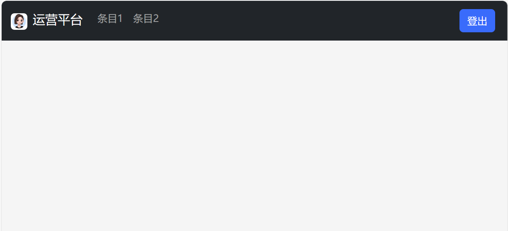

<div align="center">
<h2> login-test 密码授权登录 </h2>
  <p> 这个项目是一个基于Flask框架的Web应用，包含了用户认证功能。</p>
  <p> 应用首页通过验证Token判断用户是否已登录，若未登录则跳转至登录页面。</p>
  <p> 登录页面接收用户输入的密码并验证，若验证通过则生成Token并保存至Cookie，跳转至首页。 </p>
  <p> logout页面接收用户的请求，删除保存在Cookie中的Token，跳转回登录页面。</p>
  <p> 整个应用使用JWT算法进行Token的加密与解密。</p>
</div>

## 😎 特点
- 前端采用Bootstrap 5.3，界面美观
- 基于Flask轻量化框架，代码简单，注释丰富
- 前端登录时密码以密文形式传输，避免被第三方截获，非常安全
- 验证通过后，以token形式保存在本地浏览器中，token有效期默认90天，期间免登录，可自行修改token有效期
- 登录密码以/data/password文本形式保存在本地，便于随时修改
- 支持docker部署
- 上手简单，免修改代码
- 占用资源小

## 🖼️ 预览截图


登录界面


登录后的主页面

## 🍜 使用运行教程

安装依赖的python库
```sh
pip install flask requests aiohttp asyncio flask_jwt_extended
```

直接运行
```sh
python app.py
```

构建docker镜像
```sh
docker build -t login-test .
docker tag login-test login-test:latest
```

在docker容器中运行
```sh
docker run -d --name login-test -h login-test --restart=unless-stopped -e TZ="Asia/Shanghai" -v /data/login-test:/app/data login-test:latest
```

默认端口号为65432

### 默认密码

默认密码：admin

## License
The texts, codes, images, photos, and videos in this repository are licensed under [MIT License](./LICENSE).